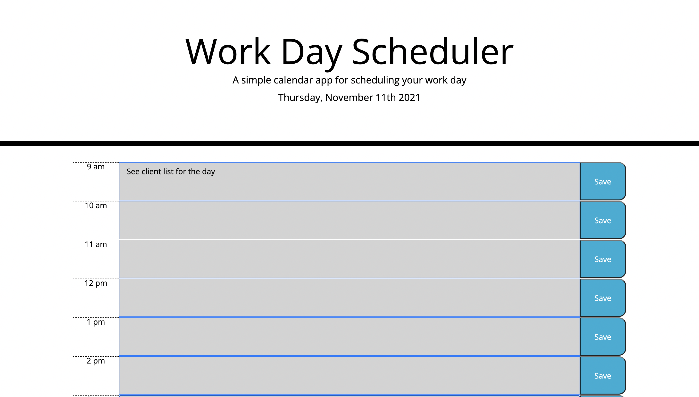

# Work Day Scheduler 

Created a daily work scheduler, it is a time block for regular business hour (9-5). You can add a task to do at a specific time and save it. If you end up wanting to change the schedule to a different time, you can delete it and write it in a different time slot and save it. 

https://mukey6.github.io/Daily-Planner/
