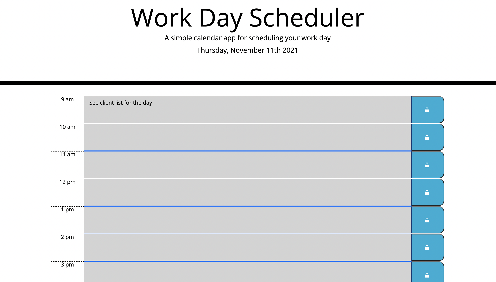

# Work Day Scheduler 

## Description 
Created a daily work scheduler, it is a time block for regular business hour (9-5). You can add a task to do at a specific time and save it. If you end up wanting to change the schedule to a different time, you can delete it and write it in a different time slot and save it. 

## Table of Contents
- [Technology Used](#technology-used)
- [Deployed Link](#Deployed-Link)
- [Contact](#contact)

## Technology Used
- HTML
- CSS
- JavaScript  

## Deployed Link
https://mukey6.github.io/Daily-Planner/

## Questions
If you have any Questions, reach me at [Email](muk.ahmed13@gmail.com) OR [Github](https://github.com/)